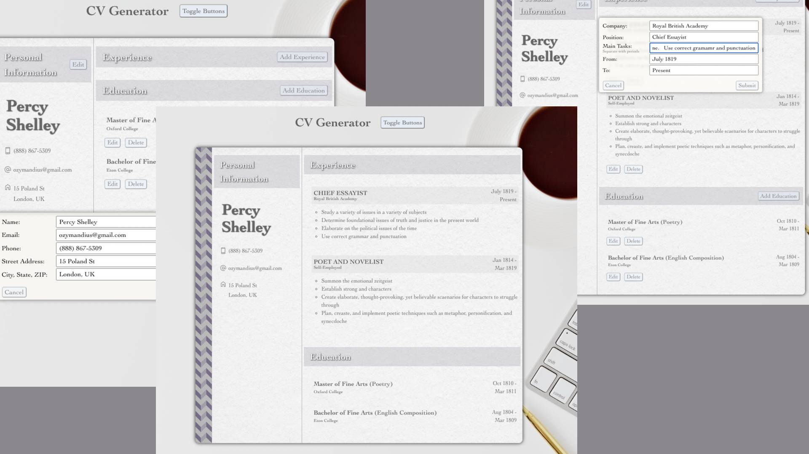

# CV Generator

An editable form that generates a professional looking CV or resume. Users are able to input personal information, experience, and education. Once entered, data is automatically formatted into CV form.

## Table of contents

- [Overview](#overview)
  - [The challenge](#the-challenge)
  - [Screenshot](#screenshot)
  - [Links](#links)
- [My process](#my-process)
  - [Built with](#built-with)
  - [What I learned](#what-i-learned)
  - [Continued development](#continued-development)

## Overview

### The challenge

Users should be able to:

- Input personal, educational, and experiential information
- Edit input information after submitting
- Delete individual items within sections
- Hide buttons on CV for printable look

Programming process should include:

- Using React to explore its functionality
- Focus on state and prop, passing information between components

### Screenshot

### Links

- Live Site URL: [CV Generator](https://jessejputnam.github.io/cv-project/)

## My process

### Built with

- Flexbox
- JavaScript
- CSS
- React
- [Webpack](https://webpack.js.org/) - Module Bundler

### What I learned

While the initial set up of components was time consuming, by the end, the component-driven design led to easy manipulation later on as I designed the view which the user would see.

Managing information in React is difficult at first. I had some of the largest issues trying to figure out passing information back and forth between components while trying to maintain the unidirecitonal flow of information. However, once I started to realize that events in the components create their own properties which the APP parent-component listens for changes in, it finally started to click how effective this communication was.

The virtual DOM is incredibly useful.

### Continued development

- I want to continue learning React -- it is a powerful tool over JavaScript which I look forward to using.
- I want to look into design patterns for React, specifically, but also more generally. I am beginning to see where my trainerless autodicaticism is causing me struggles in design without proper exemplars or instructional aid.
